#  Sonare

### Navigation communautaire & affichage immersif (sonar sous-marin / GTA IV)

# ⚠️ Disclaimer

Ce projet est strictement destiné à un usage éducatif et technique.  
  
Sonare est une expérimentation personnelle en développement mobile et design d’interface.  
Il a été pensé comme un projet complet, mené de A à Z dans une logique d’apprentissage : de l’idée initiale à la conception d’un produit fonctionnel, en passant par l’architecture, le développement, le design et l’intégration technique.  
  
Bien que l’application soit entièrement fonctionnelle et comporte des fonctionnalités avancées, elle ne doit en aucun cas être utilisée en situation réelle.  
  
Elle n’est pas destinée à être publiée, diffusée ou utilisée dans un contexte de conduite ou de circulation routière.  
  
En particulier :
- L’application ne doit pas être utilisée pour éviter des contrôles routiers ou détecter la présence des forces de l’ordre.
- Toute tentative de contournement de la loi, ou tout usage dans un contexte réel, est fermement déconseillé.
- L’auteur décline toute responsabilité en cas d’usage détourné du code, des idées ou de l’application.


# 🚔 Description

Sonare est une application mobile de **navigation communautaire**, conçue pour visualiser en temps réel les **zones de contrôle routier** et la **présence policière**.  
  
Inspirée de l’expérience utilisateur de Waze et de l'écran d'un sonar sous-marin, elle propose deux modes de visualisation complémentaires : **une carte classique** affichant toutes les informations géolocalisées, et une **mini-carte circulaire** centrée sur l’utilisateur.  
  
Cette **mini-carte**, affiche uniquement la zone autour du conducteur dans un cercle. La **police** et les **zones de contrôle** proches apparaissent sous forme de **marqueurs** et de **zone** directement sur la carte, tandis que ceux plus éloignés sont **indiqués sur le bord du cercle** par des points dont la taille varie selon la distance, offrant ainsi une perception intuitive des alertes à proximité.


#  📝 Fonctionnalités

## 1. Navigation et visualisation

**2 modes de carte distincts :**

- **🗺️ Mode Explorer** : **Carte classique**, style Google Maps, offrant une vue ouverte et fluide.
  Affichage en temps réel des zones de contrôle et de la présence policière, signalées par la communauté.  
  Les alertes proches sont affichées sous forme de marqueurs précis. Lors du dézoom, ces marqueurs se regroupent en "centroids" pour éviter la surcharge visuelle.  
  Le déplacement de la caméra sur la carte suit de manière fluide la position de l’utilisateur sans à-coups.


- **🧿​​​ Mode Sonare** : Interface inspirée d'un **sonar sous-marin** et de la **mini-carte de GTA IV**.
  Carte centrée sur la position de l’utilisateur, avec possibilité de zoomer mais sans déplacement manuel de la carte.  
  La rotation de la carte se fait via la **boussole** du telephone de l'utilisateur, et via le vecteur de **direction de déplacement** si il est en mouvement.  
  Les alertes à l’intérieur du cercle apparaissent sous forme de marqueurs et de zones comme dans le mode Explorer.  
  Les alertes hors du cercle sont affichées sur la bordure sous forme de points dynamiques, qui tournent avec la rotation de la carte et dont la taille varie en fonction de la distance.

## 2. Système d’alerte et notifications

**🚧 Seuils de distance pour les alertes :**
- Avertissement le plus loin : 3 km
- Avertissement médian : 800 m
- Avertissement urgent : 400 m

**🚨 Avertissements :**
- **🔊 Alertes sonores** déclenchées dès qu’une zone de contrôle ou présence policière approche selon ces seuils.
- **🔔 Notifications en arrière-plan** : L’application envoie des notifications même lorsque l’utilisateur n’est pas actif dans l’application, à chaque franchissement d’un seuil de distance pour une alerte, ou pour chaque nouvelle alerte détectée.

## 3. Interface utilisateur

**💡 Tutoriel initial :** un court guide est présenté au premier lancement pour expliquer rapidement les fonctionnalités et l’objectif de l’application.  
  
**⏱️ Compteur de vitesse** flottant, affichant la vitesse de l’utilisateur en temps réel, présent dans les deux modes de navigation.
  
**Plusieurs boutons :**
- Paramètres (burger menu)
- Centrer la caméra sur la position utilisateur (caméra qui suit les déplacements)
- Ouvrir un panneau bas (bottom sheet) pour signaler une zone de contrôle ou présence policière
- Changer de mode de visualisation

## 4. Menu paramètres

- Activation/désactivation des **alertes sonores**
- Activation/désactivation des **notifications push**
- Activation/désactivation de l'affichage et alertes spécifiques pour les zones de contrôle ou pour la présence policière
- Accès aux termes et conditions


# ✨ Design & interface

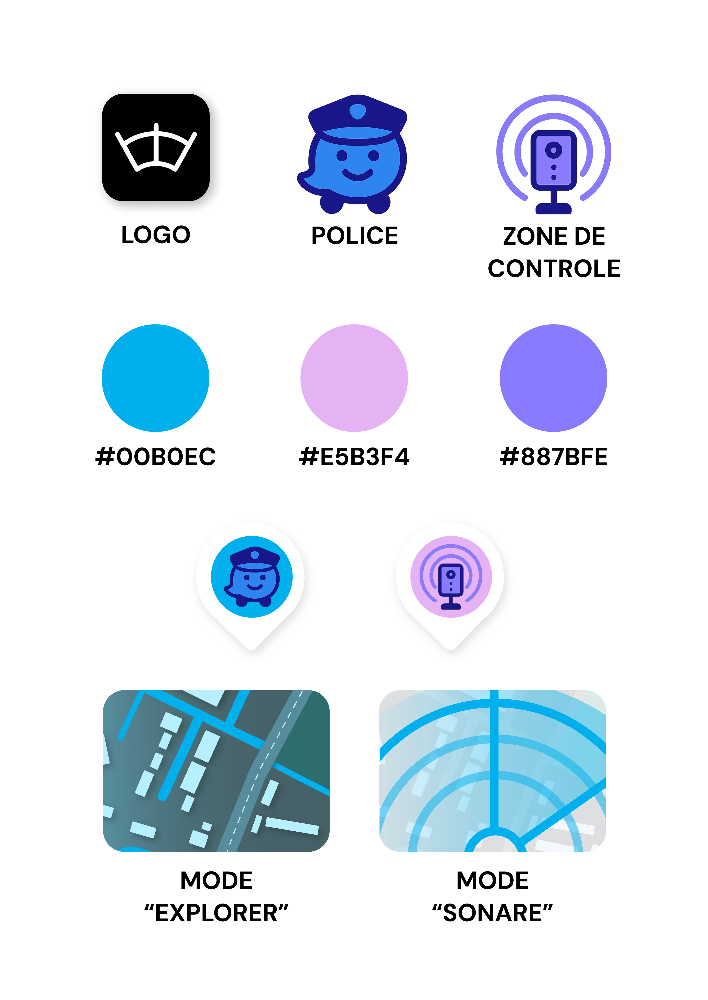

### Explorer
<p>
  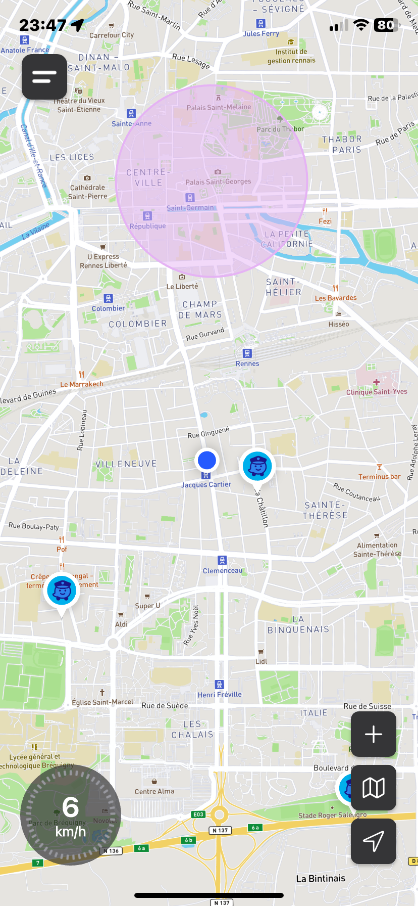
  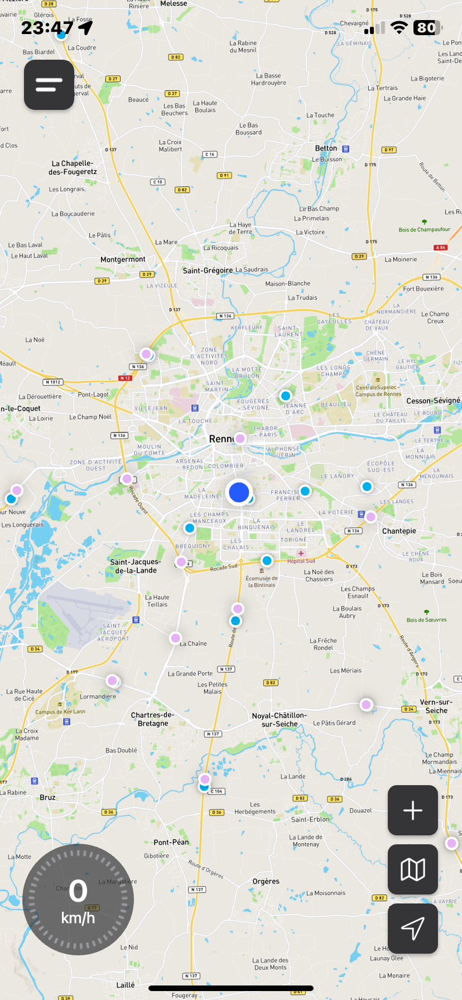
</p>

### Sonare

<p>
  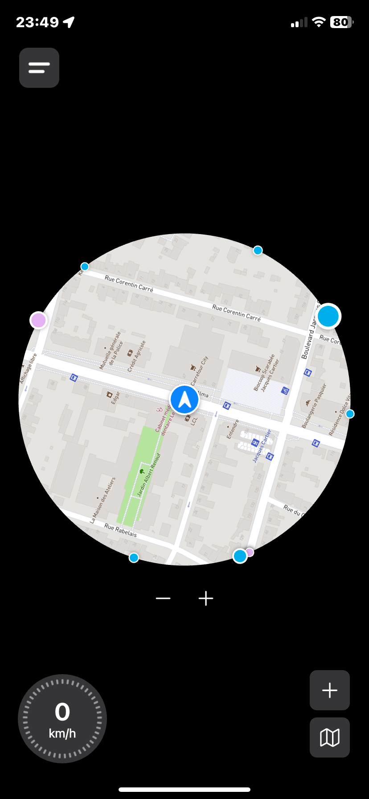
  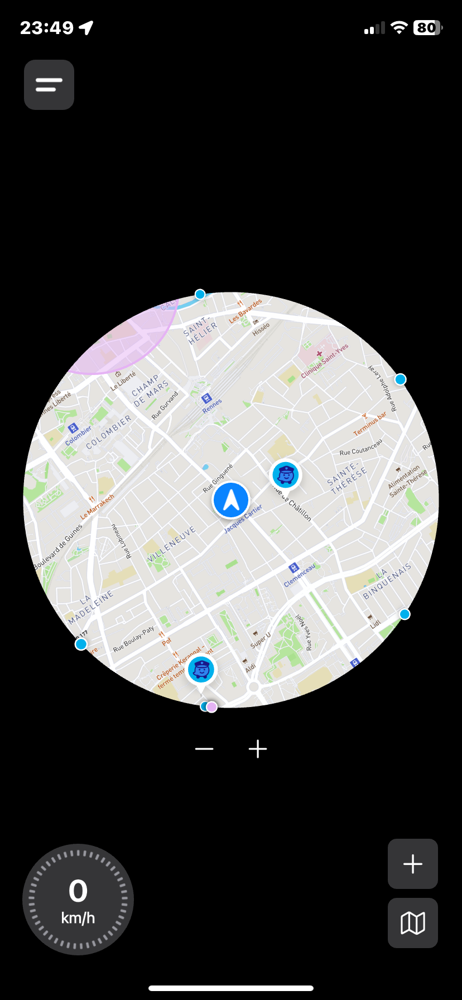
</p>

### Interface

<p>
  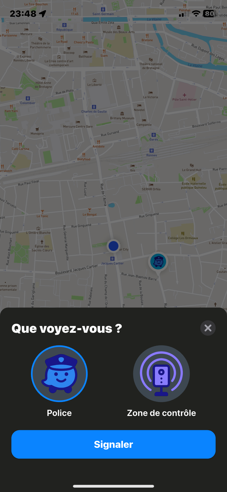
  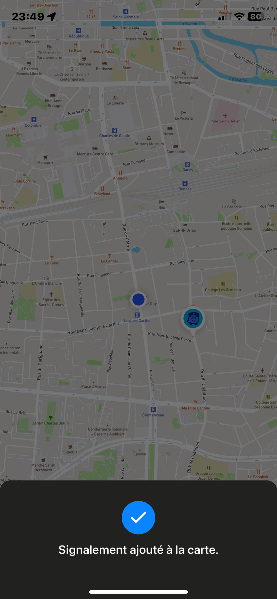
  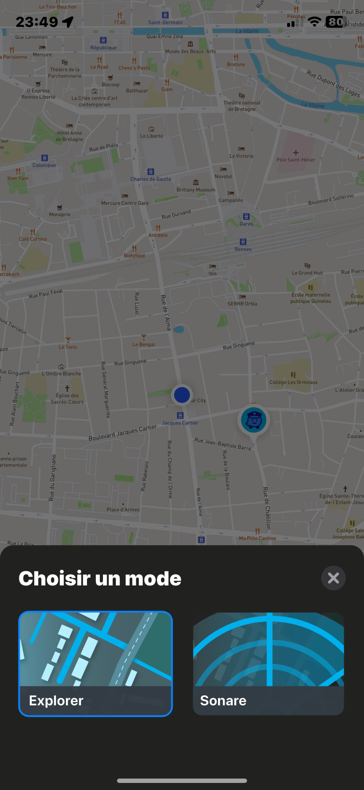
</p>

### Paramètres

<p>
  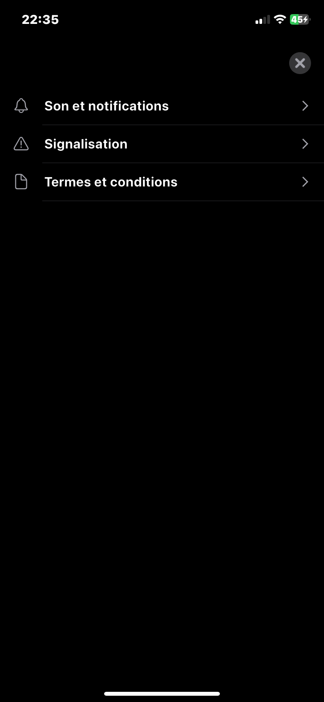
  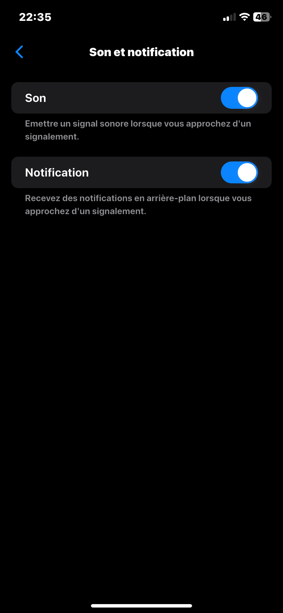
  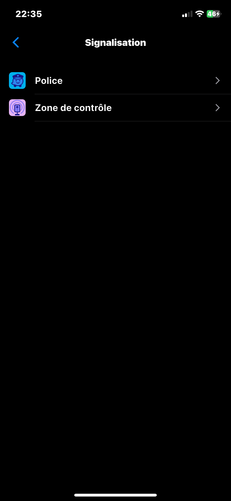
  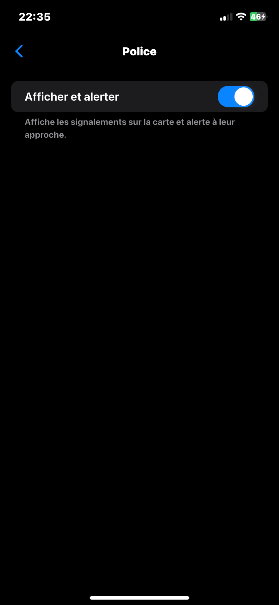
</p>

### Tutoriel
<p>
  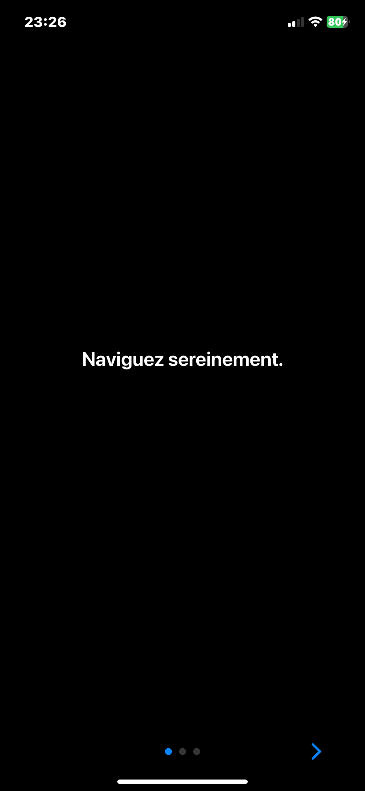
  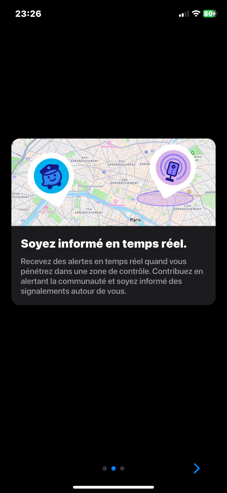
  
</p>

### Notifications

<p>
  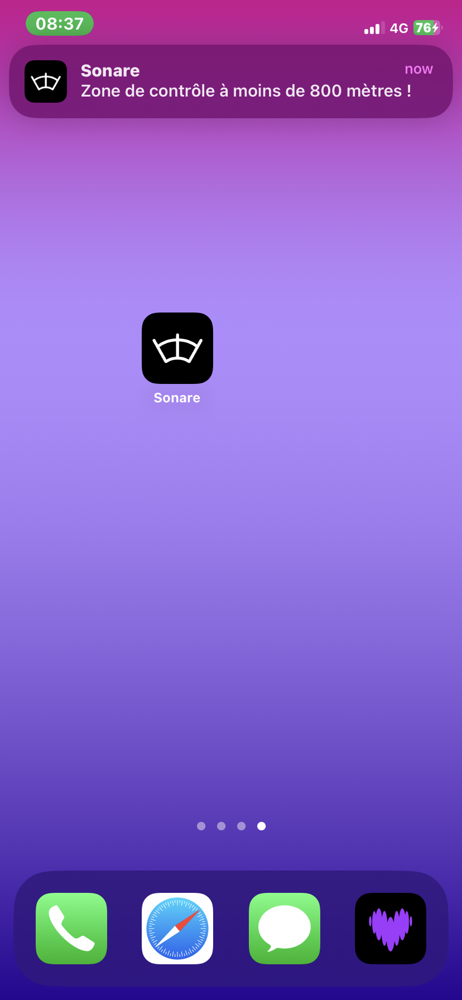
  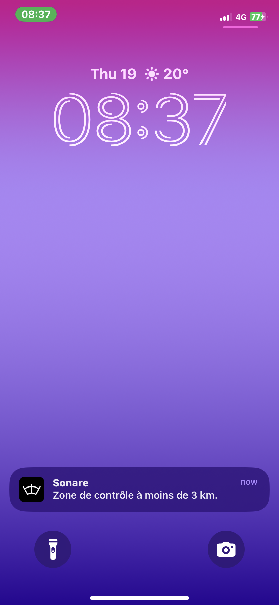
</p>


# 🛠️ Installation

## Prerequis

- **🐳 Docker**
- **📱 Flutter**

## Run

### 1. API

Dans le dossier de l'API **"spring"**, lancez :
```bash
docker-compose up -d
```
L’API sera accessible sur le port 8080.

### 2. Flutter App

- Ouvrez le fichier **settings.dart** et mettez à jour la valeur de la variable **apiUrl** avec l'adresse de votre API :
```dart
  static String apiUrl = 'http://172.20.10.2:8080';
```

- Dans le dossier **"flutter"**, récupérez les dépendances :
```bash
flutter pub get
```

- Lancez l'app :
```bash
flutter run
```